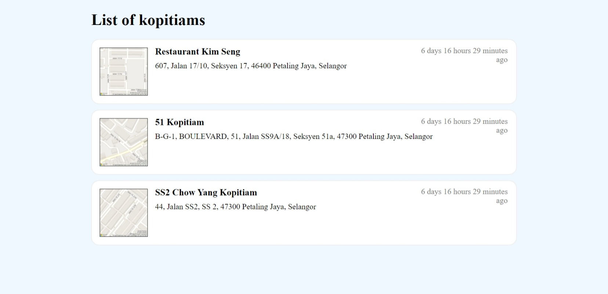

# ToyKopitiamList

This project is a test app that has:
- a MySQL database containing a list of 'kopitiam' information;
- a C# ASP.NET backend server that, connects to the database using ODBC, and serves the kopitiam information in JSON form; and
- a plain HTML+JS page, served by the ASP.NET server as well, that fetches and displays the info from the backend

